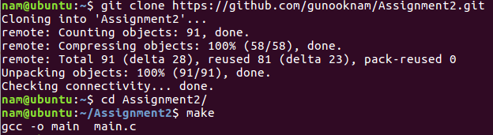

# Assignment2
팀장

2013722067 남건욱([gunooknam](https://github.com/gunooknam))

팀원

2013722049 변주형([JooHyungByun](https://github.com/JooHyungByun))

2013722001 최영진([gulike7](https://github.com/gulike7))

# Introduction

### 파일비교 프로그램 구현

 현재 디렉토리내에 있는 두개의 텍스트 파일인 text1, text2의 정보를 비교해서 출력해주는

프로그램을 구현한다. 

- 기능
  - 파일 사이즈 비교
  - 파일 블락 수 비교
  - 파일 수정 날짜(월/일) 비교
  - 파일 수정 시간(시/분) 비교

# Installation

본 프로그램은 리눅스상에서 동작하는 프로그램임을 전제로 하며 다음과 같은 리눅스 커맨드 라인 명령어로 실행이 가능하다. 

# Result Screen
